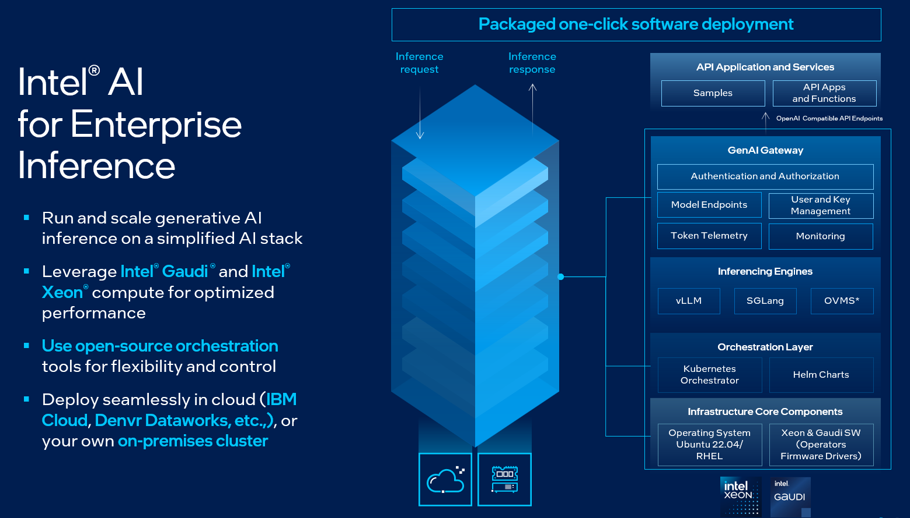

# Intel® AI for Enterprise Inference

Unleash the power of AI Inference on Intel Silicon

The Intel® AI for Enterprise Inference is aimed to streamline and enhance the deployment and management of AI inference services on Intel hardware. Utilizing the power of Kubernetes Orchestration, this solution automates the deployment of LLM models to run faster inference, provision compute resources, and configure the optimal settings to minimize the complexities and reduce manual efforts.

It supports a broad range of Intel hardware platforms, including Intel® Xeon® Scalable processors and Intel® Gaudi® AI Accelerators, ensuring flexibility and scalability to meet diverse enterprise needs.

Intel® AI for Enterprise Inference, powered by OPEA, is compatible with OpenAI standard APIs, enabling seamless integration to enterprise applications both on-premises and in cloud-native environments. This compatibility allows businesses to leverage the full capabilities of Intel hardware while deploying AI models with ease. With this suite, enterprises can efficiently configure and evolve their AI infrastructure, adapting to new models and growing demands effortlessly. 

#### Key Components:
   - **Kubernetes**: A powerful container orchestration platform that automates the deployment, scaling, and management of containerized applications, ensuring high availability and efficient resource utilization.
   - **Habana AI Operator**: A specialized operator that manages the lifecycle of Habana AI resources within the Kubernetes cluster, enabling efficient utilization of Intel® Gaudi® hardware for AI workloads. (Applicable only to Gaudi based deployments)
   - **Ingress NGINX Controller**: A high-performance reverse proxy and load balancer for traffic, responsible for routing incoming requests to the appropriate services within the Kubernetes cluster, ensuring seamless access to deployed AI models.
   - **Keycloak**: An open-source identity and access management solution that provides robust authentication and authorization capabilities, ensuring secure access to AI services and resources within the cluster.
   - **APISIX**: A cloud-native API gateway, handling API traffic and providing advanced features caching, and authentication, enabling efficient and secure access to deployed AI models.
   - **Observability**: An open-source monitoring solution designed to operate natively within Kubernetes clusters, providing comprehensive visibility into the performance, health, and resource utilization of deployed applications and cluster components through metrics, visualization, and alerting capabilities.
   - **Model Deployments**: Automated deployment and management of AI LLM models within the Kubernetes inference cluster, enabling scalable and reliable AI inference capabilities.
   
## Table of Contents
-   [Supported Models](#supported-models)
-   [Usage](#usage)
-   [Support](#support)
-   [License](#license)
-   [Security](#security)
-   [Trademark Information](#trademark-information)

## Supported Models
The following table lists the pre-validated models for Intel® AI for Enterprise Inference.      

| **Gaudi-Optimized Models**                                                                 | **CPU-Optimized Models**                                                                 |
|---------------------------------------------------------------------------------------------|-------------------------------------------------------------------------------------------|
| 1. [**llama-8b**](https://huggingface.co/meta-llama/Llama-3.1-8B-Instruct)                  | 21. [**cpu-llama-8b**](https://github.com/huggingface/text-generation-inference/pkgs/container/text-generation-inference) |
| 2. [**llama-70b**](https://huggingface.co/meta-llama/Llama-3.1-70B-Instruct)                | 22. [**cpu-deepseek-r1-distill-qwen-32b**](https://huggingface.co/deepseek-ai/DeepSeek-R1-Distill-Qwen-32B) |
| 3. [**codellama-34b**](https://huggingface.co/codellama/CodeLlama-34b-Instruct-hf)          | 23. [**cpu-deepseek-r1-distill-llama8b**](https://huggingface.co/deepseek-ai/DeepSeek-R1-Distill-Llama-8B) |
| 4. [**mixtral-8x7b**](https://huggingface.co/mistralai/Mixtral-8x7B-Instruct-v0.1)          |                                                                                           |
| 5. [**mistral-7b**](https://huggingface.co/mistralai/Mistral-7B-Instruct-v0.3)              |                                                                                           |
| 6. [**bge-base-en-v1.5**](https://huggingface.co/BAAI/bge-base-en-v1.5)             |                                                                                           |
| 7. [**bge-reranker-v2-m3**](https://huggingface.co/BAAI/bge-reranker-base) |                                                                                           |
| 8. [**falcon3-7b**](https://huggingface.co/tiiuae/Falcon3-7B-Instruct)                      |                                                                                           |
| 9. [**deepseek-r1-distill-qwen-32b**](https://huggingface.co/deepseek-ai/DeepSeek-R1-Distill-Qwen-32B) |                                                                                           |
| 10. [**deepseek-r1-distill-llama8b**](https://huggingface.co/deepseek-ai/DeepSeek-R1-Distill-Llama-8B) |                                                                                           |
| 11. [**llama3-405b**](https://huggingface.co/meta-llama/Llama-3.1-405B-Instruct)            |                                                                                           |

## Usage
The Usage instructions for the AI Inference as a Service Deployment Automation can be found in the [docs/README.md](docs/README.md) file.
To setup, follow the step-by-step instructions provided in the `docs/README.md` file.

## Support
For feature requests, bugs or questions about the project, [open an issue](https://github.com/opea-project/Enterprise-Inference/issues) on the GitHub Issues page. Provide as much details as possible, including steps to reproduce the issue, expected behavior, and actual behavior.

## License
Intel® AI for Enterprise Inference is licensed under the [Apache License Version 2.0](LICENSE). Refer to the "[LICENSE](LICENSE)" file for the full license text and copyright notice.

## Security
The [Security Policy](SECURITY.md) outlines our guidelines and procedures for ensuring the highest level of security and trust for our users who consume Intel® AI for Enterprise RAG.

## Trademark Information
Intel, the Intel logo, Xeon, and Gaudi are trademarks of Intel Corporation or its subsidiaries.

* Other names and brands may be claimed as the property of others.
&copy; Intel Corporation
